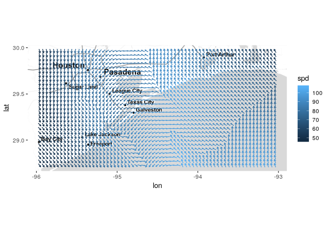

<!-- README.md is generated from README.Rmd. Please edit that file -->
[](https://travis-ci.org/mitchelloharawild/ggquiver)
[](https://cran.r-project.org/package=ggquiver)
[](https://cran.r-project.org/package=ggquiver)

ggquiver
========

Quiver plots for ggplot2.

Installation
------------

The **stable** version can be installed from CRAN:

``` r
install.packages("ggquiver")
```

The **development** version can be installed from GitHub using:

``` r
# install.packages("devtools")
devtools::install_github("mitchelloharawild/ggquiver")
```

Usage
-----

*ggquiver* introduces a new geom `geom_quiver()`, which produces a
quiver plot in *ggplot2*.

Quiver plots for functions can easily be produced using ggplot
aeshetics. When a grid is detected, the size of the vectors are
automatically adjusted to fit within the grid.

``` r
expand.grid(x=seq(0,pi,pi/12), y=seq(0,pi,pi/12)) %>%
  ggplot(aes(x=x,y=y,u=cos(x),v=sin(y))) +
  geom_quiver()
```


The *ggplot2* example for seal movements is easily reproduced, with
appropriately scaled arrowhead sizes. Here, the vecsize is set to zero
to not resize the vectors.

``` r
ggplot(seals, aes(x=long, y=lat, u=delta_long, v=delta_lat)) + 
  geom_quiver(vecsize=0) + 
  borders("state")
```


Quiver plot arrows can be centered about x and y coordinates, which is
useful when working with maps and scaled vectors.

``` r
library(ggmap)
library(dplyr)

wind_data <- wind %>% filter(between(lon, -96, -93) & between(lat, 28.7, 30))
qmplot(lon, lat, data=wind_data, extent="panel", geom = "blank", zoom=8, maptype = "toner-lite") + 
  geom_quiver(aes(u=delta_lon, v=delta_lat, colour = spd), center=TRUE)
```


