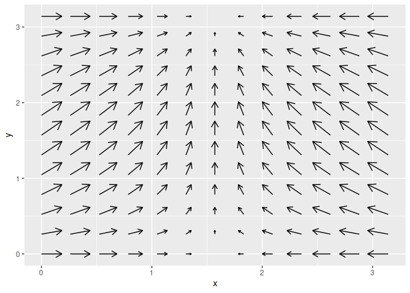
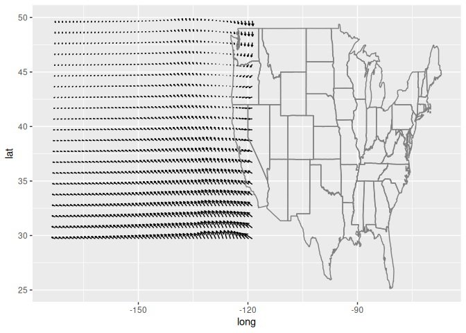
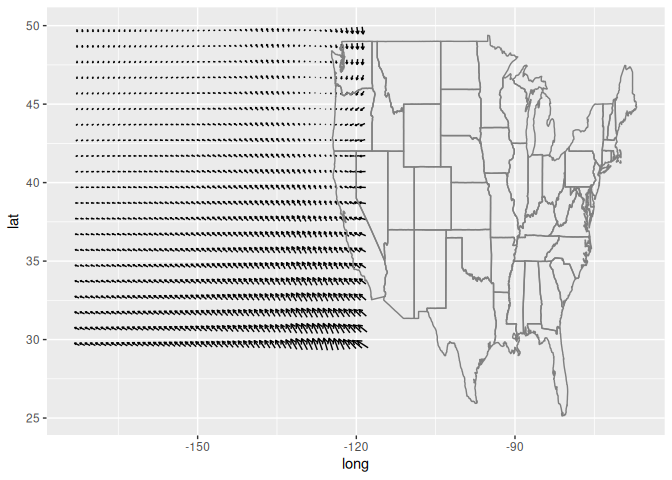

<!-- README.md is generated from README.Rmd. Please edit that file -->

<!-- badges: start -->

[](https://github.com/mitchelloharawild/ggquiver/actions/workflows/R-CMD-check.yaml)
[](https://cran.r-project.org/package=ggquiver)
[](https://cran.r-project.org/package=ggquiver)
<!-- badges: end -->

# ggquiver <a href="https://pkg.mitchelloharawild.com/ggquiver/"></a>

Quiver plots for ggplot2. An extension of ‘ggplot2’ to provide quiver
plots to visualise vector fields. This functionality is implemented
using a geom to produce a new graphical layer, which allows aesthetic
options. This layer can be overlaid on a map to improve visualisation of
mapped data.

## Installation

The **stable** version can be installed from CRAN:

``` r
install.packages("ggquiver")
```

The **development** version can be installed from GitHub using:

``` r
# install.packages("remotes")
remotes::install_github("mitchelloharawild/ggquiver")
```

## Usage

*ggquiver* introduces a new geom `geom_quiver()`, which produces a
quiver plot in *ggplot2*.

Quiver plots for functions can easily be produced using ggplot
aeshetics. When a grid is detected, the size of the vectors are
automatically adjusted to fit within the grid.

``` r
library(ggplot2)
library(ggquiver)
expand.grid(x=seq(0,pi,pi/12), y=seq(0,pi,pi/12)) |> 
  ggplot(aes(x=x,y=y,u=cos(x),v=sin(y))) +
  geom_quiver()
```



The *ggplot2* example for seal movements is easily reproduced, with
appropriately scaled arrowhead sizes. Here, the vecsize is set to zero
to not resize the vectors.

``` r
library(maps)
world <- sf::st_as_sf(map('world', plot = FALSE, fill = TRUE))

ggplot(seals) + 
  geom_quiver(
    aes(x=long, y=lat, u=delta_long, v=delta_lat),
    vecsize=0
  ) + 
  geom_sf(data = world) +
  coord_sf(xlim = c(-173.8, -117.8), ylim = c(28.7, 50.7), expand = FALSE) + 
  labs(title = "Seal movements", x = NULL, y = NULL)
```



Quiver plot arrows can be centered about x and y coordinates, which is
useful when working with maps and scaled vectors.

``` r
ggplot(seals) + 
  geom_quiver(
    aes(x=long, y=lat, u=delta_long, v=delta_lat),
    vecsize=0, center = TRUE
  ) + 
  geom_sf(data = world) +
  coord_sf(xlim = c(-173.8, -117.8), ylim = c(28.7, 50.7), expand = FALSE) + 
  labs(title = "Seal movements (centered arrows)", x = NULL, y = NULL)
```



The arrows can be customised using the `arrow` parameter from
`grid::arrow()`. For example, to use closed arrowheads:

``` r
ggplot(seals) + 
  geom_quiver(
    aes(x=long, y=lat, u=delta_long, v=delta_lat),
    vecsize=0, center = TRUE,
    arrow = arrow(type = "closed")
  ) + 
  geom_sf(data = world) +
  coord_sf(xlim = c(-173.8, -117.8), ylim = c(28.7, 50.7), expand = FALSE) + 
  labs(title = "Seal movements (closed arrows)", x = NULL, y = NULL)
```


